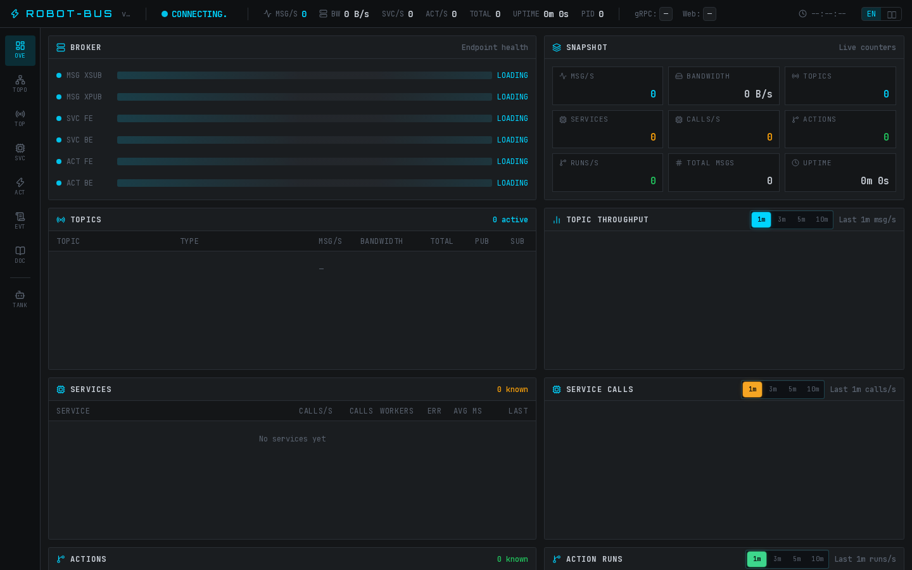
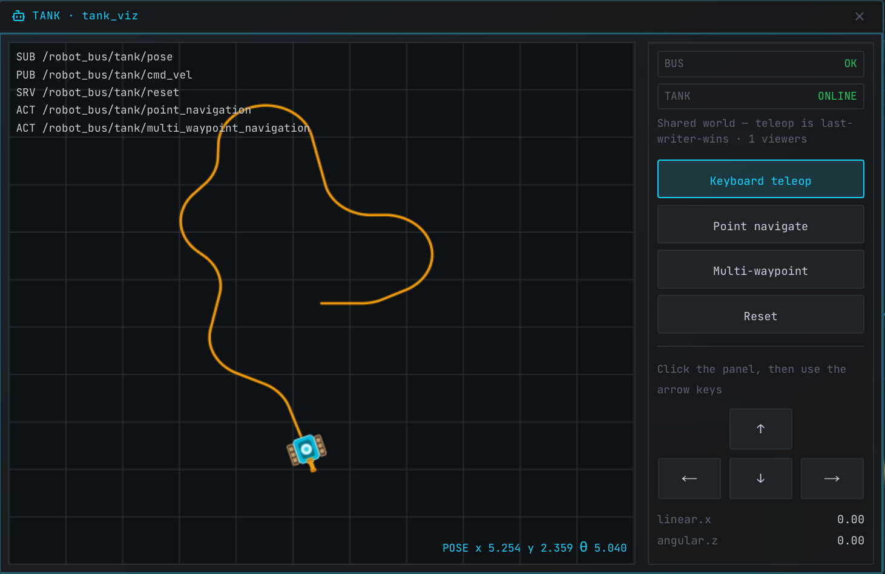

[English](README.md) | 中文

# *Robot Bus*

[](https://github.com/indunet/robot-bus/actions/workflows/ci.yml)
[](https://github.com/indunet/robot-bus/security/code-scanning)
[](https://crates.io/crates/robot-bus)
[](https://pypi.org/project/robot-bus/)
[](https://www.npmjs.com/package/robot-bus)
[](https://central.sonatype.com/artifact/org.indunet/robot-bus)
[](https://www.apache.org/licenses/LICENSE-2.0.html)

Robot Bus 是一套轻量级、多语言的通信 **框架**，提供类 ROS 2 的编程模型（topic / service / action、`Node` + `spin`），底层基于 ZeroMQ。它不是要取代 ROS 2，而是把 ROS 生态扩展到完整 ROS 2 栈不易部署或偏重的环境（例如 Android、Windows、浏览器客户端）。

SDK：**Rust**、**Python**、**TypeScript**、**C++**、**Java**、**Android**。



*Web 控制台* — Overview / Topics / Services / Actions / Topology。启动 `robot-bus-broker` 后打开 [http://127.0.0.1:15570](http://127.0.0.1:15570)。详见 [§4 Web 控制台](#4-web-控制台) 与 [小坦克示例](#32-小坦克示例)。

## *设计理念*

- **类 ROS 2 模型，更轻的运行时：** 提供 topic、service、action 以及 `Node` + `spin`，不依赖 ROS 发行版，不必 `source setup.bash`，也不搭 workspace —— 一个 broker 进程加任一语言 SDK 即可。
- **API 可迁移：** 命名与用法贴近 ROS 2，便于后续迁成 ROS 2 节点；也可以继续跑在 robot-bus 上，通过 [ROS 2 桥](#5-ros-2-桥) 与现有 ROS 2 图互通。
- **面向真实部署：** 在 Android、Windows、浏览器以及其他不便安装完整 ROS 2 的主机上，使用同一套编程模型。

## *核心功能*

- **类 ROS 2 原语：** Topic 发布/订阅、service、action（`send_goal` → GoalHandle → `result` / `cancel`）、定时器与参数。
- **一个 broker，多种语言：** Rust、Python、TypeScript、C++、Java、Android SDK 接入同一条总线。
- **内嵌 Web 控制台：** Overview、Topics、Services、Actions、Topology，以及内置小坦克示例 —— 无需额外前端进程。
- **可选 ROS 2 桥：** 进程内用 `rclrs` / `rclpy` / `rclcpp` 桥接 topic / service / action（Humble / Jazzy）。未启用桥时，核心 SDK 不依赖 ROS。
- **Protobuf 契约：** 全部载荷使用 Protocol Buffers（不是 ROS CDR），目录与常见 ROS 2 包名对齐，见 [`proto/`](proto/)。
- **浏览器与远程客户端：** WebSocket RPC（`Node::ws` / `Node.ws`；传输 `"ws"`）。**不兼容旧版：** `/ws` 为 V3 成帧（opcode + 原始 payload），V2 客户端连不上。

Node 编程模型——`Context` / `Node`、topic pub-sub、service、action 以及 `spin`——为稳定的公开 API。

### *文档*

- 各语言指南：[`docs/zh/`](docs/zh/)（Python / Rust / TypeScript / C++ / Java / Android）
- ROS 2 桥：[`docs/zh/ros2-bridge.md`](docs/zh/ros2-bridge.md)
- 迁移手册：[`docs/skills/`](docs/skills/)
- 性能报告：[`docs/zh/perf-report.md`](docs/zh/perf-report.md)

### *安装*

* Python（含 `robot-bus-broker` 命令行）

```bash
pip install robot-bus
```

* Rust

```toml
robot-bus = "2.0.0"
```

* npm

```bash
npm install robot-bus
```

* Maven

```xml
<dependency>
    <groupId>org.indunet</groupId>
    <artifactId>robot-bus</artifactId>
    <version>2.0.0</version>
</dependency>
```

C++ 安装包（DEB / MSI）与 Android（`org.indunet:robot-bus-android`）见 [§3.6](#36-其他语言)。


## *1. 典型应用场景*

### *1.1 轻量级的类 ROS 2 通信*

当无需完整 ROS 2 安装时，robot-bus 以更小的体积提供相近的编程模型，适用于原型验证、工具链、Windows 主机以及资源受限的部署。

### *1.2 与 ROS 2 组成异构系统*

在 Ubuntu（或其他 Linux 主机）上照常运行 ROS 2，同时将部分计算部署在 Android 等不便安装完整 ROS 2 的设备上。这些节点使用 robot-bus，保持相同的话题 / 服务 / Action 模型，再通过 ROS 2 桥接入 ROS 2 图。

### *1.3 在 bus 上原型开发，再迁移至 ROS 2*

robot-bus 轻量、环境简单，适合先完成节点原型与联调验证，再将已验证的设计迁移为原生 ROS 2 节点；也可继续运行在 bus 上，仅桥接需要进入 ROS 2 图的接口。

迁移手册（给开发者 / Agent 用）：[`docs/skills/ros2-to-robot-bus`](docs/skills/ros2-to-robot-bus/SKILL.md) 与 [`docs/skills/robot-bus-to-ros2`](docs/skills/robot-bus-to-ros2/SKILL.md)。在 Cursor 里 `@` 这两个文件，或直接说「把某包迁到 robot-bus / ROS 2」。

## *2. 架构*

```
  应用 (Python / Rust / C++ / Java / Android / …)
                    │
                    │  ZMQ (tcp / ipc / inproc) 或 WebSocket RPC
                    ▼
             robot_bus_broker
                    │
                    │  可选 ros2_bridge（rclrs / rclpy / rclcpp）
                    ▼
               ROS 2 图
```

## *3. 快速开始*

### *3.1 安装并启动 broker*

```bash
pip install robot-bus
robot-bus-broker
```

默认 API / Web 控制台 / WebSocket 监听：`http://0.0.0.0:15570`。broker 启动后，用浏览器打开 [Web 控制台](#4-web-控制台) 即可查看。

可运行示例（topic、service、action，Rust / Python / C++）：[`examples/`](examples/)。

也可在进程内启动 broker：

```python
import robot_bus

with robot_bus.RobotBusBroker.start() as broker:
    # 业务代码 …
    pass
```

### *3.2 小坦克示例*



内置的小坦克仿真，无需先写代码即可看到 topic 端到端跑通：

1. 启动 broker（`robot-bus-broker`）。
2. 打开 **http://127.0.0.1:15570**，在侧栏点击 **TANK**（或访问 `/tank/`）。
3. 点击面板后，用 **方向键** 遥控；也可切换到点选导航，在地图上 **鼠标点击** 下发目标点。

打开面板会拉起进程内 tank 节点：订阅 `/robot_bus/tank/cmd_vel`，发布 `/robot_bus/tank/pose`。多浏览器共享同一场景（遥控 last-writer-wins）。不需要时可加 `--no-tank`。侧栏 **文档** 默认显示，可用 `--no-docs` 隐藏。

### *3.3 Topic（发布 / 订阅）*

```python
import robot_bus
from robot_bus.sensor_msgs.msg.v1 import Imu
from robot_bus.geometry_msgs.msg.v1 import Vector3

def on_imu(topic, imu: Imu):
    print(topic, imu.linear_acceleration)

node = robot_bus.Node("pilot")

imu_pub = node.create_publisher("/robot1/imu", Imu)
node.create_subscription("/robot1/imu", on_imu, msg_type=Imu)
imu_pub.publish(Imu(linear_acceleration=Vector3(x=0.0, y=0.0, z=9.8)))
# node.spin()
```

### *3.4 Service*

```python
import robot_bus
from robot_bus.std_srvs.srv.v1 import SetBoolRequest, SetBoolResponse

def on_set_bool(req: SetBoolRequest) -> SetBoolResponse:
    return SetBoolResponse(success=True, message=f"set:{req.data}")

server = robot_bus.Node("worker")
client = robot_bus.Node("caller")

server.create_service(
    "/set_bool", on_set_bool,
    request_type=SetBoolRequest, response_type=SetBoolResponse,
)
svc = client.create_client(
    "/set_bool",
    request_type=SetBoolRequest, response_type=SetBoolResponse,
)
# reply = svc.call(SetBoolRequest(data=True), timeout=5.0)
# server.spin()
```

### *3.5 Action*

```python
import robot_bus
from robot_bus.example_interfaces.action.v1 import (
    FibonacciGoal, FibonacciFeedback, FibonacciResult,
)

def on_fibonacci(goal: FibonacciGoal, context):
    seq = list(range(goal.order))
    context.publish_feedback(FibonacciFeedback(sequence=seq[:1]))
    return FibonacciResult(sequence=seq)

server = robot_bus.Node("worker")
client = robot_bus.Node("caller")

server.create_action_server(
    "/fibonacci", on_fibonacci,
    goal_type=FibonacciGoal,
    feedback_type=FibonacciFeedback,
    result_type=FibonacciResult,
)
act = client.create_action_client(
    "/fibonacci",
    goal_type=FibonacciGoal,
    feedback_type=FibonacciFeedback,
    result_type=FibonacciResult,
)
goal = act.send_goal(
    FibonacciGoal(order=5),
    feedback_callback=lambda fb: print(fb.sequence),
)
# result = goal.result(timeout=10.0)
# server.spin()
```

更多说明见 [`docs/zh/python-api.md`](docs/zh/python-api.md)。

### *3.6 其他语言*

| 语言 | 包 / 产物 | 文档 |
|------|-----------|------|
| Python | [PyPI `robot-bus`](https://pypi.org/project/robot-bus/) | [`docs/zh/python-api.md`](docs/zh/python-api.md) |
| Rust | [crates.io `robot-bus`](https://crates.io/crates/robot-bus) | [`docs/zh/rust-api.md`](docs/zh/rust-api.md) |
| TypeScript | [npm `robot-bus`](https://www.npmjs.com/package/robot-bus) | [`docs/zh/typescript-api.md`](docs/zh/typescript-api.md) |
| C++ | [GitHub Releases](https://github.com/indunet/robot-bus/releases)（DEB / MSI） | [`docs/zh/cpp-api.md`](docs/zh/cpp-api.md) |
| Java | Maven Central `org.indunet:robot-bus` | [`docs/zh/java-api.md`](docs/zh/java-api.md) |
| Android | Maven Central `org.indunet:robot-bus-android` | [`docs/zh/android-api.md`](docs/zh/android-api.md) |
| ROS 2 桥 | 分语言（`rclrs` / `rclpy` / `rclcpp`） | [`docs/zh/ros2-bridge.md`](docs/zh/ros2-bridge.md) |

## *4. Web 控制台*

Broker 内嵌监控界面（Overview、Topics、Services、Actions、Topology、日志）——截图见本文开头。执行 `robot-bus-broker`（或 `RobotBusBroker.start()`）后，用浏览器打开：

**http://127.0.0.1:15570**

上手可先试侧栏 **TANK** 的 [小坦克示例](#32-小坦克示例)。侧栏 **文档** 默认显示，可用 `--no-docs` 隐藏。与 API / WebSocket 网关同端口。可用 `--no-console` 关闭整个 UI。前端源码在 [`console/`](console/)；本地改 UI 见 [`console/README.md`](console/README.md)。

## *5. ROS 2 桥*

进程内在 robot-bus 与 ROS 2 之间桥接 topic / service / action。各语言使用原生客户端（`rclrs` / `rclpy` / `rclcpp`）。官方支持：**Humble**、**Jazzy**。未启用桥时，核心 SDK 不依赖 ROS。

需要已 source 的 ROS 2 发行版与 `rclpy`，以及正在运行的 broker：

```bash
source /opt/ros/humble/setup.bash   # 或 jazzy
robot-bus-broker                    # 另一个终端
```

```python
import robot_bus
from robot_bus.ros2_bridge import (
    Direction,
    Ros2Bridge,
    StdMsgsStringMapper,
    TriggerServiceMapper,
)

assert robot_bus.ros2_available()

bridge = (
    Ros2Bridge.new("ros_bridge")
    .bus_tcp("localhost")
    .route("/chatter", "/chatter")
    .mapper(StdMsgsStringMapper())
    .direction(Direction.Ros2ToBus)
    .add()
    .service("/reset", "/reset")
    .mapper(TriggerServiceMapper())
    .add()
    .build()
)
bridge.spin()
```

完整说明与示例（Rust / Python / C++）：[`docs/zh/ros2-bridge.md`](docs/zh/ros2-bridge.md)。若要做整包迁移（而不只是桥接），见 [`docs/skills/`](docs/skills/)。

## *6. Protobuf 消息*

robot-bus 的全部载荷——**topic**、**service**、**action**——均以 **Protocol Buffers** 定义与序列化。线上是 protobuf 字节流（不是 ROS CDR）。typed API 在创建时绑定 protobuf 消息类型并自动编解码；省略类型则按原始字节收发。

契约位于 [`proto/`](proto/)，按 ROS 风格目录组织，并对标常见 ROS 2 包名：

```text
proto/<package>/{msg|srv|action|grpc}/v1/*.proto
```

| 种类 | 建模方式 |
|------|----------|
| Topic | 单个 `*.msg` protobuf 消息 |
| Service | `*.srv` 下的一对 `*Request` / `*Response` |
| Action | `*.action` 下的 Goal / Feedback / Result |

内置了大量常用类型，并对标 ROS 2 常见包，示例如下：

| 种类 | ROS 2 | robot-bus |
|------|-------|-----------|
| Topic | `sensor_msgs/msg/Imu` | `robot_bus.sensor_msgs.msg.v1.Imu` |
| Topic | `geometry_msgs/msg/Twist` | `robot_bus.geometry_msgs.msg.v1.Twist` |
| Topic | `nav_msgs/msg/Odometry` | `robot_bus.nav_msgs.msg.v1.Odometry` |
| Service | `std_srvs/srv/SetBool` | `robot_bus.std_srvs.srv.v1.SetBoolRequest` / `SetBoolResponse` |
| Action | `example_interfaces/action/Fibonacci` | `robot_bus.example_interfaces.action.v1.FibonacciGoal` / … |
| Topic | `tf2_msgs/msg/TFMessage` | `robot_bus.tf2_msgs.msg.v1.TFMessage` |

生成代码随发布包分发（PyPI、crates.io、npm、DEB/MSI、Maven），使用方无需安装 `protoc`。消息模块处于 `robot_bus` 命名空间，并不在线上占用顶层 ROS 包名。完整列表见 [`proto/`](proto/)。

### *6.1 自定义消息*

内置类型不够时，按同样的 protobuf 约定自行定义即可。typed API 接受任意 protobuf 消息类（不必放进 robot-bus 仓库）。

1. 编写 `.proto`（建议沿用 ROS 风格包路径）：

```protobuf
syntax = "proto3";
package my_robot.msg.v1;

message BatteryStatus {
  double voltage = 1;
  double percentage = 2;
}
```

2. 用 `protoc` 生成你自己工程里的代码，例如 Python：

```bash
protoc --python_out=. --pyi_out=. my_robot/msg/v1/battery_status.proto
```

3. 像内置类型一样挂到 Node 上：

```python
from my_robot.msg.v1 import battery_status_pb2 as pb

node = robot_bus.Node("bms")
pub = node.create_publisher("/battery", pb.BatteryStatus)
node.create_subscription("/battery", lambda t, msg: print(msg.voltage), msg_type=pb.BatteryStatus)
pub.publish(pb.BatteryStatus(voltage=48.0, percentage=0.85))
```

若希望把类型贡献进本仓库的内置集合：把文件放到 [`proto/`](proto/) 对应目录，再执行 `just gen-python`（或其他 `just gen-*`）重新生成。

## *7. 贡献*

如果你对本项目感兴趣并希望参与（开发/测试/文档），欢迎通过邮箱联系：<deng_ran@aliyun.com>

开发 *Robot Bus* 并非出于盈利，而是在纷繁日常里，写代码能让我回到内心的宁静。若它也对你有所助益，便是我持续打磨的动力。


## *8. 许可*

Robot Bus 以 [Apache 2.0 许可](LICENSE) 发布。

```
Copyright 2026 indunet.org

Licensed under the Apache License, Version 2.0 (the "License");
you may not use this file except in compliance with the License.
You may obtain a copy of the License at the following link.

     http://www.apache.org/licenses/LICENSE-2.0

Unless required by applicable law or agreed to in writing, software
distributed under the License is distributed on an "AS IS" BASIS,
WITHOUT WARRANTIES OR CONDITIONS OF ANY KIND, either express or implied.
See the License for the specific language governing permissions and
limitations under the License.
```
